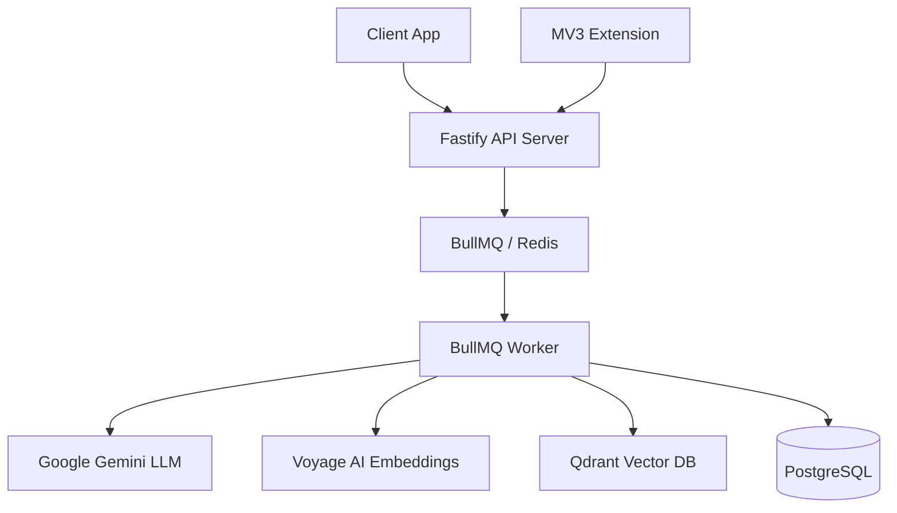

<!-- Source: hackforge-analyze | Confidence: [STRONG] | Version: v1 | Checkpoint: analyze-complete | Dependencies: none -->
# Blueprint: Memora

## Metadata
- **Type:** PRODUCT
- **Domain:** Personal Real-Time Memory Layer
- **Cultural Context:** default
- **Generated:** 2026-07-18-115542

## Problem Statement
Users struggle to retain, organize, and retrieve information they consume daily on the web. Memora provides a personal, real-time memory layer that automatically and manually captures web content, extracts key text, creates vector embeddings, and indexes them in PostgreSQL and Qdrant. It runs background loops for semantic consolidation, speculative dreaming, and self-reflection to construct an interactive, queryable personal knowledge graph.

## User Goal Mapping
- **What changes in user's life:** Seamless recall of previously viewed pages, automatic extraction of insights, synthesis of answers citing personal sources.
- **Displaced habits:** Manually bookmarking, copy-pasting notes, forgetting sources.

## Target Users
- **Primary Persona:** Power web consumers, researchers, developers, and writers seeking an effortless external brain.

## Architecture
### Pattern: Monorepo (Client, Extension, Server, Worker, Shared)
- **Rationale:** Strict separation of concern. Fastify API is stateless and fast, delegating intensive tasks to BullMQ workers to maintain responsiveness.

### System Design

### Component Breakdown
- **client:** React 19 + Tailwind v4 + Vite client dashboard.
- **extension:** Manifest V3 browser capture extension overlay context panel.
- **server:** Fastify API server running routes and service handlers.
- **worker:** BullMQ worker executing background jobs and cognitive loops.
- **shared:** Type definitions, Zod schemas, and common models.

### Data Flow
Capture (Extension/Client) -> Fastify endpoint -> Postgres (Meta storage) -> BullMQ Job -> Chunking & Embedding (Voyage) -> Qdrant (Vector indexing) -> Semantic Search / Synthesis (Gemini).

### Data Architecture: SQL (PostgreSQL) + Vector (Qdrant)
- **Rationale:** Relational data matches Postgres schema; semantic search requires high-dimensional vector index (Qdrant).

### Real-Time: SSE + WebSockets
- **Rationale:** SSE for streaming synthesis answers; WebSockets for proactive suggestions and calendar briefs.

## Tech Stack
| Layer | Choice | Version | Why | Alternative | Confidence |
|---|---|---|---|---|---|
| Frontend | React + Vite | ^19.0.0 | High performance, component lifecycle | Next.js | [STRONG] |
| CSS | TailwindCSS | @import "tailwindcss" (v4) | CSS-in-theme, tokens, speed | Custom CSS | [STRONG] |
| Backend | Fastify | ^5.0.0 | Low overhead, fast HTTP response | Express | [STRONG] |
| Queue | BullMQ | ^5.0.0 | Robust queueing, cron triggers | RabbitMQ | [STRONG] |
| Database | PostgreSQL + Prisma | ^6.0.0 | Reliable ACID, type-safe queries | MongoDB | [STRONG] |
| Vector DB | Qdrant | Latest | Dedicated fast HNSW indexing | pgvector | [STRONG] |

## Build Order (Sequenced)
1. **shared** package (Zod schemas, types)
2. **server** package (Prisma setup, database schema, Fastify routes)
3. **worker** package (BullMQ queue runners, AI embed service)
4. **client** package (React layout, context states)
5. **extension** package (MV3 content/background scripts)

## Risk Assessment
- **Risk:** Vector database latency
- **Likelihood:** Medium
- **Mitigation:** Scalar quantization and HNSW payload filtering.

## Kill Conditions
- Gemini API pricing structure becomes unviable for small workloads.
- Local model fallbacks cannot run efficiently inside extension context.
