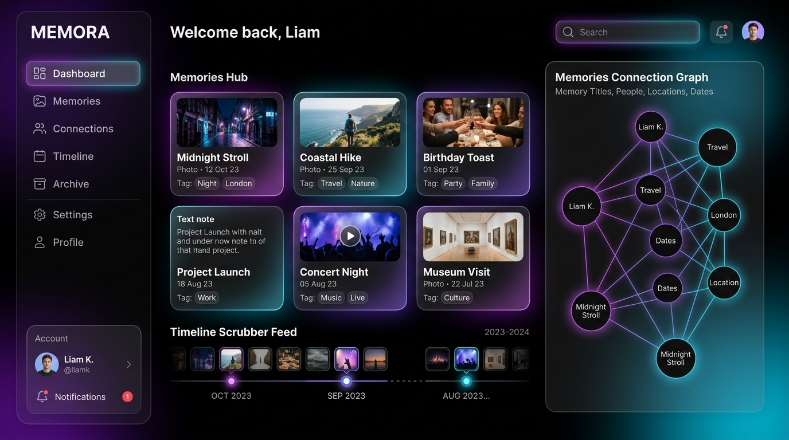
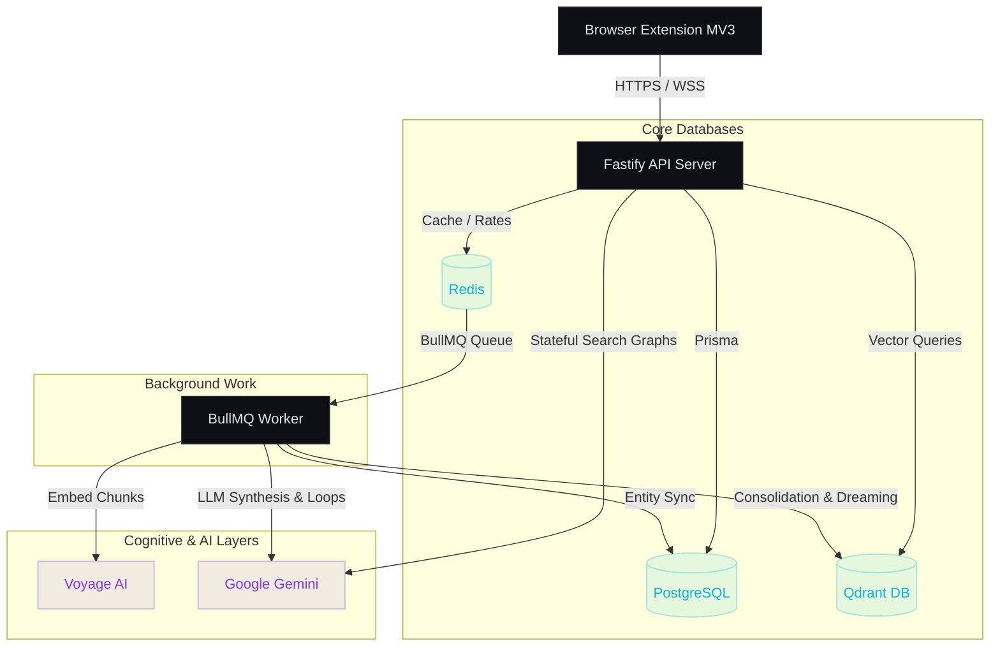

# Memora

**Personal real-time memory layer that captures, indexes, and synthesizes everything you read and learn.**



Memora turns your browsing activity, notes, and saved content into a searchable, AI-synthesized knowledge base. It captures information passively through a browser extension, chunks and embeds it for semantic retrieval, and applies continuous loop engineering—self-reflection, consolidation, evaluation, and dreaming—to surface insights you didn't know you had.

---

## Architecture Overview



Content flows from the browser extension through the API server, which persists relational data in PostgreSQL and enqueues async work via Redis-backed BullMQ queues. The background worker processes jobs—chunking text, generating embeddings via Voyage AI, storing vectors in Qdrant, and running LLM synthesis through Google Gemini. Loop engineering processes run on scheduled intervals to consolidate similar memories, discover latent connections, and continuously improve retrieval quality.

---

## Tech Stack

| Layer              | Technology                  | Purpose                                      |
| ------------------ | --------------------------- | -------------------------------------------- |
| API Server         | Fastify                     | High-performance HTTP/WebSocket server        |
| Frontend           | React + Vite                | Dashboard and sidebar UI                     |
| Task Queue         | BullMQ                      | Reliable async job processing                |
| Relational DB      | PostgreSQL + Prisma         | Users, memories, folders, billing, metadata  |
| Vector DB          | Qdrant                      | Semantic similarity search over embeddings   |
| Cache / Queues     | Redis                       | Session cache, rate limiting, BullMQ backend |
| Embeddings         | Voyage AI                   | High-quality text embedding generation       |
| LLM                | Google Gemini               | Synthesis, reflection, consolidation         |
| Payments           | Stripe                      | Subscription billing and checkout            |
| Browser Extension  | Manifest V3                 | Content capture, sidebar, autocapture        |

---

## Getting Started

### Prerequisites

- **Node.js** 20+
- **pnpm** 9+
- **Docker** and **Docker Compose**

### Setup

```bash
# 1. Clone the repository
git clone https://github.com/your-org/memora.git
cd memora

# 2. Install dependencies
pnpm install

# 3. Start infrastructure services
docker-compose up -d

# 4. Run database migrations
pnpm migrate

# 5. Seed initial data
pnpm seed

# 6. Start all services in development mode
pnpm dev
```

The API server starts on `http://localhost:4000`, the dashboard on `http://localhost:3000`, and the browser extension can be loaded from `extension/dist` via Chrome's developer mode.

---

## Package Structure

```
memora/
├── shared/         # Shared types, constants, validation schemas, utilities
├── server/         # Fastify API server, routes, middleware, Prisma client
├── worker/         # BullMQ worker, job processors, loop engine
├── client/         # React + Vite dashboard application
├── extension/      # Manifest V3 browser extension
├── docs/           # Architecture, API, security, and testing documentation
├── docker-compose.yml  # Local infrastructure (Postgres, Redis, Qdrant)
├── pnpm-workspace.yaml
├── turbo.json
└── package.json
```

| Workspace     | Description                                                                 |
| ------------- | --------------------------------------------------------------------------- |
| `shared`      | TypeScript types, Zod schemas, constants, and utility functions             |
| `server`      | Fastify HTTP server with REST/WebSocket routes, auth, billing, and Prisma   |
| `worker`      | BullMQ job processors for embedding, consolidation, reflection, and loops   |
| `client`      | React dashboard for searching, browsing timeline, managing folders/settings |
| `extension`   | Chrome extension for passive capture, manual selection, sidebar overlay     |

---

## Roadmap

### Phase 1 — Core Capture & Search
- Browser extension with page capture, text selection, and screenshot
- Ingest pipeline: chunking → embedding → Qdrant storage
- Semantic search with LLM-synthesized answers
- Timeline view with source filtering
- User authentication (JWT RS256) and basic settings

### Phase 2 — Integrations & Proactive
- Third-party integrations (Notion, Readwise, Kindle, Twitter bookmarks)
- Proactive suggestions surfaced via extension sidebar
- Folder organization and tagging
- Knowledge graph with entity extraction and relationship mapping
- People tracking and context linking

### Phase 3 — Loops & Automation
- Self-reflection loop: periodic analysis of memory patterns
- Consolidation loop: merge similar or duplicate memories
- Evaluation loop: measure retrieval quality and embedding drift
- Multi-agent debate for complex synthesis tasks
- Dreaming loop: discover non-obvious connections during idle periods
- User-defined automation rules with safety guardrails

### Phase 4 — Teams & Advanced
- Team workspaces with shared memory pools
- Role-based access control and invite flow
- Data export and account portability
- Stripe billing with free, pro, and team tiers
- Comments and collaborative annotations on memories

---

## Contribution Guide

We welcome contributions to Memora! Please follow these guidelines:

### Monorepo Workflow
- This project uses a `pnpm` monorepo layout managed by Turborepo.
- Run `pnpm install` in the root to install all package dependencies.
- Run `pnpm dev` to start all packages concurrently under Turborepo.
- Run `pnpm build` to compile all packages.

### Code Organization
- Write reusable types, constant configurations, and schemas in the `shared` workspace.
- Write API endpoints, database interactions (Prisma), and middlewares in the `server` workspace.
- Write background jobs, processors, and loops in the `worker` workspace.
- Write browser-specific UI/scripts in the `extension` workspace.
- Write the main dashboard application code in the `client` workspace.

### Quality Standards
- TypeScript is used strictly across all workspaces. Ensure type-safety.
- Prettier is configured for style consistency. Make sure to run prettier formatting before submitting changes.

---

## License

MIT — see [LICENSE](./LICENSE) for details.
