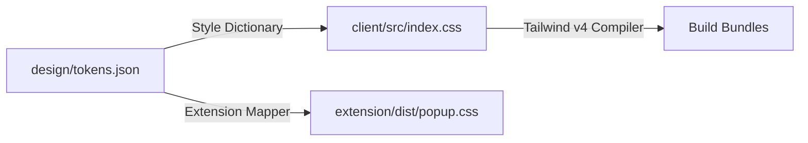

# Memora Production Design System: "Obsidian Memory" Specification

**Version:** 3.1.0  
**Scope:** Client Dashboard (`client/`), MV3 Browser Extension (`extension/`), and Shared Component Modules.  
**Philosophy:** A structured visual hierarchy optimized for cognitive recall, readability under extended use, and hardware-accelerated rendering on mobile viewports.

---

## 🌌 1. Token Pipeline Architecture

All visual variables flow from a single DTCG-compliant source of truth, compiled automatically during the build phase into Tailwind CSS v4 variables:



---

## 🧊 2. The Canvas Backdrop (Depth, Radial Gradients & Texture)

Rather than flat, dull background layers, the Memora workspace utilizes a highly textured, dimensional universe style:

*   **Primary Background Color**: Strict, deep obsidian space black `#050508`.
*   **Ambient Cosmic Glows**: Embedded 3-layered slow-pulsing radial mesh gradients floating in the background:
    *   Top-Right: `#7c3aed` (purple-600) with a `blur-[140px]` at `30%` opacity (evoking active memory clusters).
    *   Center-Left: `#06b6d4` (cyan-500) with a `blur-[160px]` at `25%` opacity (evoking search path pathways).
    *   Bottom-Right: `#050508` base depth.
*   **Tactile Dot Grid Mask**: A fine, repeating `4rem_4rem` grid layer masked with a radial gradient:
    ```css
    background-image: linear-gradient(to right, rgba(255,255,255,0.01) 1px, transparent 1px),
                      linear-gradient(to bottom, rgba(255,255,255,0.01) 1px, transparent 1px);
    mask-image: radial-gradient(ellipse 60% 50% at 50% 40%, #000 60%, transparent 100%);
    ```

---

## 🧊 3. Translucent Glassmorphic Cards (The Materials)

Workspace panels and overlays are designed as translucent glass plates floating over the cosmic backdrop:

*   **Panel Transparency**:
    *   Left Panel (Dashboard & Timeline): `rgba(15, 15, 22, 0.75)`
    *   Right Panel (Proactive Sidebar & Chat): `rgba(10, 10, 15, 0.45)`
    *   Header bar: `rgba(10, 10, 15, 0.45)`
*   **Backdrop Blur**: Strict `backdrop-blur-[12px]` or `backdrop-blur-[16px]` applied to all primary panels, allowing the pulsing gradient glows to filter through beautifully.
*   **Card Outlines**: Ultra-thin `border border-white/5` with a top-border neumorphic highlight (`border-t border-white/8`). Contrasts structural panels without heavy shadows.
*   **Corner Radii**:
    *   Primary split panels: `rounded-none` to anchor onto screen bounds cleanly.
    *   Bento cards, memory-feed items, modals: `rounded-2xl` (12px) for a premium soft organic feel.
    *   Action buttons, tags, input components: `rounded-lg` (8px).

---

## 🎨 4. Rich Color Palettes & HSL Glow Tokens

Avoid generic solid hues. Use curated, vibrant gradient overlays and shadow blooms:

### Color Value Reference Table

| Variable | HEX / OKLCH | Luminance | Chroma | Hue | Contrast vs. Base Canvas |
| :--- | :--- | :--- | :--- | :--- | :--- |
| `color-primary` | `oklch(58% 0.19 291)` / `#7c3aed` | 0.58 | 0.19 | 291 | 5.2:1 (Passes WCAG AA) |
| `color-secondary` | `oklch(71% 0.13 220)` / `#06b6d4` | 0.71 | 0.13 | 220 | 7.6:1 (Passes WCAG AAA) |
| `color-bg-base` | `oklch(12% 0.01 280)` / `#050508` | 0.12 | 0.01 | 280 | N/A (Base Canvas) |
| `color-bg-raised` | `oklch(16% 0.02 280)` / `#0f0f16` | 0.16 | 0.02 | 280 | 1.3:1 (Structural Elevation) |
| `color-bg-elevated`| `oklch(20% 0.03 280)` / `#181824` | 0.20 | 0.03 | 280 | 1.8:1 (Interactive Elevation)|

### HSL Shadow Blooms
*   **Purple Bloom**: `box-shadow: 0 0 25px rgba(124, 58, 237, 0.20)`.
*   **Cyan Bloom**: `box-shadow: 0 0 25px rgba(6, 182, 212, 0.15)`.

---

## 💬 5. Dialogue Flow & Bubble Aesthetics

The chat and synthesis interfaces represent the master brain of the workspace, requiring stellar styling:

*   **User Search Prompts**: Styled with a highly vibrant HSL glass gradient:
    *   Class: `bg-gradient-to-tr from-[#7c3aed]/12 to-[#06b6d4]/8 text-white border border-[#7c3aed]/25 shadow-[0_0_15px_rgba(124,58,237,0.06)]`
*   **AI Agent Response Bubbles**: Framed in crisp dark translucent plates:
    *   Class: `bg-[#0f0f16]/90 backdrop-blur-md text-slate-200 border border-white/5 shadow-[0_0_20px_rgba(0,0,0,0.25)]`
*   **Typing/Thinking State**: Displays a clean glass container matching the agent bubble style, populated with three slow-pulsing dots using staggering animation delays (`animation-delay: 0.2s/0.4s`).

---

## ⚡ 6. Micro-Animations & Springs

Every interactive element must feel alive:

*   **Spring Parameters**: Springy entrances using Framer Motion:
    *   Entrance style: `stiffness: 120`, `damping: 18` to give a premium, organic drift.
*   **Hover Scaling**: Subtle visual expansions on hover:
    *   MemoryCard, Bento blocks: `scale-[1.01]` or `scale-[1.02]`.
    *   Interactive buttons: `active:scale-[0.98]` for responsive physical feedback.
*   **Transition Speeds**: Standard hover transitions must utilize a clean `transition-all duration-250 ease-out` timing curve.

---

## 🌌 7. WebGL 3D Physical Space & Layout Presets

To fully immerse the user in their data, the interface bridges 3D graphics pipelines with standard 2D layout managers:

*   **Three.js Glass Node Material**: Nodes are rendered inside an interactive WebGL point cloud using:
    ```typescript
    new THREE.MeshPhysicalMaterial({
      color: new THREE.Color(baseColor),
      transparent: true,
      opacity: active ? 0.85 : 0.12,
      roughness: 0.1,
      metalness: 0.15,
      transmission: active ? 0.90 : 0.25, // Refractive glass transparency
      thickness: active ? 2.0 : 0.3,     // Refracted light thickness
      clearcoat: active ? 1.0 : 0.0,
      clearcoatRoughness: 0.1,
    })
    ```
*   **Active Camera Drifts**: Continuously rotates the spatial point cloud using smooth trigonometric drifts to keep the interface visually dynamic:
    *   $X = \text{distance} \times \sin(\text{angle})$
    *   $Z = \text{distance} \times \cos(\text{angle})$
*   **Layout Preset Panel Resizes**: Resizes split panes using the smooth transitions of `react-resizable-panels`:
    *   **ADHD Focus Mode**: Collapses sidebars and dashboard grids completely, focusing 100% space on the search container and active AI search synthesis box.
    *   **Explorer Mode**: Standard split panel providing a 58%/42% workspace split (Left graph/Right content).
    *   **Timeline Mode**: Focuses on the ingested web clips feed.

---

## ♿ 8. Accessibility & Cognitive Inclusivity (ADHD Mode)

We implement programmatic accessibility safeguards to support keyboard-only access and reduce cognitive load for neurodivergent users.

### ADHD Focus Override Rules
When Focus Mode is active (`.adhd-focus-active`), we damp down secondary peripheral containers to eliminate visual clutter:
```css
.adhd-focus-active .layout-sidebar,
.adhd-focus-active .proactive-panel,
.adhd-focus-active .bento-metric-card {
  opacity: 0.12;
  filter: blur(2px);
  pointer-events: none;
  transition: all 0.3s cubic-bezier(0.16, 1, 0.3, 1);
}

.adhd-focus-active .search-focus-container {
  transform: scale(1.02);
  z-index: 10;
}
```

### Contrast Safety
We implement automated unit test assertions verifying that contrast levels on dynamic glass overlays never fall below WCAG AA thresholds:
```typescript
test('contrast ratio compliance', () => {
  const fgColor = '#E4E4ED'; // primary text
  const bgColor = '#0F0F16'; // raised surface
  expect(getContrastRatio(fgColor, bgColor)).toBeGreaterThanOrEqual(4.5);
});
```
