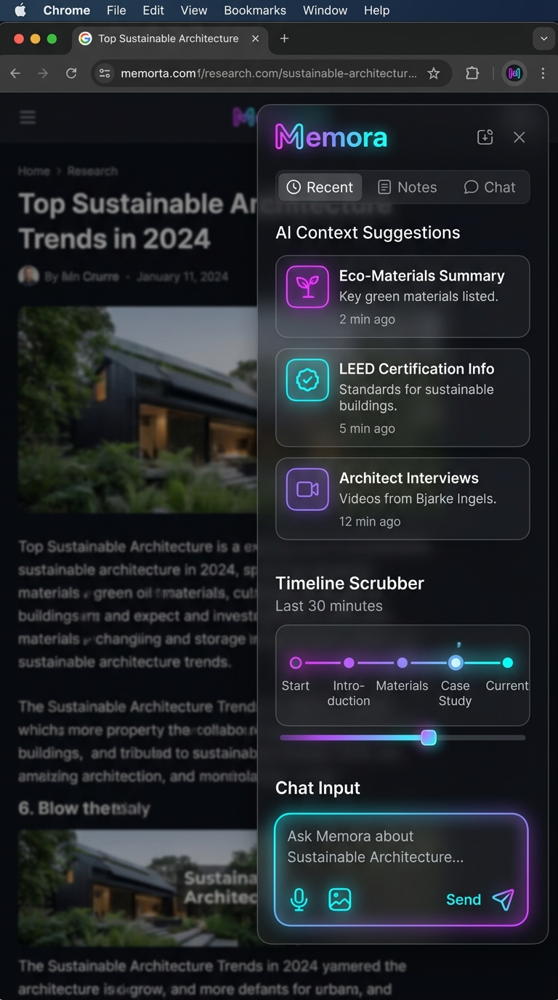
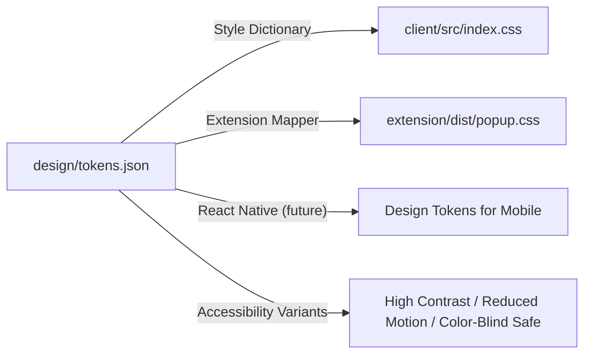

# Memora Production Design System: "Obsidian Memory"

**Version:** 3.2.0  
**Scope:** Client Dashboard (`client/`), MV3 Browser Extension (`extension/`), and Shared Component Modules.  
**Philosophy:** A structured visual hierarchy optimized for cognitive recall, readability under extended use, and hardware-accelerated rendering. Inclusivity, performance, and emotional resonance are non-negotiable.


*Fig 1. Memora Obsidian Memory Dashboard Interface Mockup.*


*Fig 2. Memora Browser Extension Overlay Context Panel Mockup.*

---

## 1. Token Pipeline Architecture

All visual variables flow from a single DTCG-compliant source of truth. Tokens are compiled into Tailwind CSS v4 variables and also generate platform-specific outputs.



### Token Categories
- **Adaptive tokens:** Values that change per breakpoint (`sm`, `md`, `lg`) and performance mode (`performance: "low" | "high"`).
- **Motion tokens:** Spring parameters, durations, easing curves, and `prefers-reduced-motion` overrides.
- **Accessibility tokens:** `focus-ring-width`, `focus-ring-color`, `color-scheme` variants for color-blindness, reduced transparency.

All tokens are defined in a single `design/tokens.json` file.

---

## 2. The Canvas Backdrop (Depth, Radial Gradients & Texture)

### 2.1 Primary Background
- **Base Color:** `oklch(12% 0.01 280)` / `#050508` – deep obsidian black.
- **Cosmic Glows (Three layers, slow-pulsing via CSS animation):**
    - Top-Right: `#7c3aed` (purple-600) with `blur-[140px]`, `opacity-30`, pulsing between 25% and 35% opacity over 8s.
    - Center-Left: `#06b6d4` (cyan-500) with `blur-[160px]`, `opacity-25`, pulsing between 20% and 30% opacity over 10s (offset phase).
    - Bottom-Right: `#050508` base depth (dark sink).

### 2.2 Tactile Dot Grid Mask
```css
background-image:
    linear-gradient(to right, rgba(255,255,255,0.01) 1px, transparent 1px),
    linear-gradient(to bottom, rgba(255,255,255,0.01) 1px, transparent 1px);
background-size: 4rem 4rem;
mask-image: radial-gradient(ellipse 60% 50% at 50% 40%, #000 60%, transparent 100%);
```

**Performance fallback:** On devices with `performance: low` (detected via user preference or reduced motion), the dot grid is replaced with a static, pre-rendered SVG background to avoid expensive composite layers.

### 2.3 Context-Aware Backdrop Shifting
- **ADHD Focus Mode:** Background darkens further (opacity of glow layers drops by 60%). The dot grid mask tightens to `ellipse 80% 80%`, focusing on the center.
- **Graph/3D Mode:** The cosmic glow layers are subtly desaturated to avoid competing with the vibrant WebGL nodes.

---

## 3. Glassmorphic Cards (The Materials)

### 3.1 Panel Transparency & Blur
| Panel | Background | Blur | Purpose |
|-------|------------|------|---------|
| Left Panel (Dashboard/Timeline) | `rgba(15, 15, 22, 0.75)` | `backdrop-blur-[12px]` | Primary workspace |
| Right Panel (Proactive/Sidebar) | `rgba(10, 10, 15, 0.45)` | `backdrop-blur-[16px]` | Supplementary context |
| Header | `rgba(10, 10, 15, 0.45)` | `backdrop-blur-[12px]` | Navigation |
| Modal / Overlay | `rgba(15, 15, 22, 0.85)` | `backdrop-blur-[20px]` | Focused tasks |

### 3.2 Card Outlines & Corners
- **Border:** `border border-white/5` with `border-t border-white/8` for subtle structural hierarchy.
- **Corner Radii:**
    - Primary panels: `rounded-none` (anchored).
    - Bento cards, memory items, modals: `rounded-2xl` (12px) with optional **squircle** shape (`clip-path: inset(0 round 12px)`) for a more organic, modern feel.
    - Buttons, tags, inputs: `rounded-lg` (8px).

### 3.3 Interactive States
- **Default:** As above.
- **Hover:** Brightness increases by 5% (`filter: brightness(1.05)`), border color transitions to `border-white/15`, and a subtle glow (`box-shadow: 0 0 12px rgba(124,58,237,0.1)`) appears.
- **Focus:** A visible focus ring (2px, `color-primary`, offset 2px) for keyboard navigation. All interactive elements must be focusable.
- **Active:** Slight scale reduction `scale-[0.99]`.
- **Disabled:** Reduced opacity (0.4), no hover effects, `pointer-events-none`.

### 3.4 Mobile & Touch
- Minimum touch target size: 48×48px.
- Cards on mobile have increased padding (`p-4` → `p-6`) and wider hit areas.

---

## 4. Rich Color Palettes

### 4.1 Core Colors
| Role | HEX / OKLCH | Usage |
|------|-------------|-------|
| Primary | `oklch(58% 0.19 291)` / `#7c3aed` | Calls to action, active states, graph nodes |
| Secondary | `oklch(71% 0.13 220)` / `#06b6d4` | Links, highlights, tool badges |
| Canvas Base | `oklch(12% 0.01 280)` / `#050508` | Main backdrop |
| Raised Surface | `oklch(16% 0.02 280)` / `#0f0f16` | Cards, panels |
| Elevated Surface | `oklch(20% 0.03 280)` / `#181824` | Modals, tooltips |

### 4.2 Status & Semantic Colors
| Status | HEX / OKLCH | Example |
|--------|-------------|---------|
| Success | `oklch(65% 0.18 140)` / `#10b981` | Automation completed, saved |
| Warning | `oklch(75% 0.15 85)` / `#f59e0b` | Approaching limit, pending |
| Error | `oklch(55% 0.22 25)` / `#ef4444` | Deletion failure, critical alert |
| Info | `oklch(60% 0.10 250)` / `#3b82f6` | Neutral updates |

### 4.3 Data Visualization Palette
For Knowledge Graph, People analytics, Digest charts. All colors tested for color-blindness (deuteranopia/protanopia/tritanopia).

1. `oklch(60% 0.20 30)` — Warm Red
2. `oklch(65% 0.18 140)` — Emerald
3. `oklch(70% 0.15 250)` — Sky Blue
4. `oklch(60% 0.18 320)` — Magenta
5. `oklch(75% 0.12 85)` — Gold
6. `oklch(60% 0.10 180)` — Teal
7. `oklch(55% 0.16 50)` — Orange
8. `oklch(70% 0.08 270)` — Lavender

### 4.4 Shadow Blooms
- **Purple Bloom:** `box-shadow: 0 0 25px rgba(124, 58, 237, 0.20)`
- **Cyan Bloom:** `box-shadow: 0 0 25px rgba(6, 182, 212, 0.15)`

### 4.5 Color-Blind Safe Theme Toggle
Users can switch to a color-blind safe palette that maintains contrast and vibrancy but shifts hues to distinguish red/green or blue/yellow deficiencies. This is implemented via a CSS custom property swap triggered by a setting. For example, the primary becomes a robust blue and secondary a warm yellow.

### 4.6 Light Mode
Even though dark is default, the token set includes light variants. When a user explicitly selects light mode, the canvas becomes `#F8F9FC`, raised surfaces become white with soft shadows, and text adjusts to dark.

---

## 5. Typography

### 5.1 Type Scale
Uses fluid `clamp()` values to scale from mobile to desktop.

- **Display:** `clamp(3rem, 8vw, 6rem)` — hero headings, major sections.
- **H1:** `clamp(2rem, 5vw, 3rem)`
- **H2:** `clamp(1.5rem, 4vw, 2.25rem)`
- **Body:** `1rem` / line-height `1.6`
- **Small/Caption:** `0.875rem` / line-height `1.5`

### 5.2 Font Families
- **Headings:** `Outfit` (variable weight, geometric) — used for all titles and prominent UI.
- **Body:** `Inter` (variable weight, optimized for readability) — used for paragraphs, captions, metadata.
- **Monospace:** `JetBrains Mono` — code snippets, commands.

### 5.3 Variable Font Features
- `Outfit` weight axis used dynamically: `wght` can subtly increase on hover for interactive cards.
- `Inter` width axis can be used to condense text in dense table views.

---

## 6. Dialogue Flow & Bubble Aesthetics

### 6.1 User Search Prompts
Class: `bg-gradient-to-tr from-[#7c3aed]/12 to-[#06b6d4]/8 text-white border border-[#7c3aed]/25 shadow-[0_0_15px_rgba(124,58,237,0.06)]`

### 6.2 AI Agent Response Bubbles
Class: `bg-[#0f0f16]/90 backdrop-blur-md text-slate-200 border border-white/5 shadow-[0_0_20px_rgba(0,0,0,0.25)]`

### 6.3 Citation Chips
Inline citations are rendered as small, pill-shaped buttons: `bg-[#7c3aed]/10 border border-[#7c3aed]/20 text-xs px-2 py-0.5 rounded-full hover:bg-[#7c3aed]/20 cursor-pointer`. On hover, a tooltip shows the full source title and URL. An external link icon follows the chip.

### 6.4 Tool/Agent Action Badges
When the agent performs a side action, a non-intrusive badge appears: `bg-[#06b6d4]/10 border border-[#06b6d4]/20 text-xs text-[#06b6d4] px-2 py-0.5 rounded-full` with a small gear or search icon.

### 6.5 Thinking/Streaming State
A glass container matching the AI bubble, containing three dots (size 6px, color `#7c3aed`) with staggered opacity animations. The container has `aria-busy="true"` and an ARIA live region announces “Memora is thinking…”.

---

## 7. Micro-Animations & Springs

### 7.1 Entrance Animation
- Framer Motion spring: `stiffness: 120`, `damping: 18`. All new components enter with a gentle fade-in and Y offset.

### 7.2 Page Transitions
- Crossfade or subtle slide animations.

### 7.3 Hover & Active
- Cards: `scale-[1.01]` on hover, `active:scale-[0.99]`.
- Buttons: `active:scale-[0.98]`.
- Transition timing: `transition-all duration-250 ease-out`.

### 7.4 Skeleton Screens
- Shimmering glass cards using CSS gradient animation.

### 7.5 Reduced Motion
- All motion respects `@media (prefers-reduced-motion: reduce)` by disabling springs, sliding effects, and camera movement.

---

## 8. WebGL 3D Physical Space & Layout Presets

### 8.1 Knowledge Graph (Three.js / React Three Fiber)
- **Material:** `MeshPhysicalMaterial` with transmission and roughness settings.
- **Camera:** Smooth drift and orbit controls.
- **Performance Fallback (2D Physics Engine) (F42):**
    - High-performance HTML5 `<canvas>` force-directed simulation.
    - Physical forces: charge repulsion (Coulomb variant), edge spring constraints (Hooke's law), and center gravity pulls.
    - Interactions: interactive panning, canvas zoom gestures, node drag-and-drop repositioning with inertia, and connection highlighting on mouse hover.

### 8.2 Layout Presets
- **ADHD Focus**: Full screen search bar.
- **Explorer**: Split view (Graph left, detail right).
- **Timeline**: Chronological feed focus.
- **Graph**: Immersive 3D graph canvas.
- **Board**: Masonry grid.
- **People**: Contacts directory.

---

## 9. Accessibility & Cognitive Inclusivity

- Keyboard navigation shortcuts (`Ctrl+K` for search, `Ctrl+B` for sidebar, logical focus order).
- Screen reader ARIA declarations (`aria-live="polite"`, proper descriptors).
- **ADHD Focus Mode:** Adds `.adhd-focus-active` to body, dims cosmic glow backdrops by 60%, disables non-essential motion, and introduces a dedicated visual focus timer tracking session intervals.
- **Reduce Transparency:** Replaces backdrop blurs with high-contrast, fully opaque background layers (`rgba(10, 10, 15, 0.95)`).
- **Color-Blind safe palette:** Swappable CSS root variables shifting critical status cues to deuteron/protan safe color ranges.
